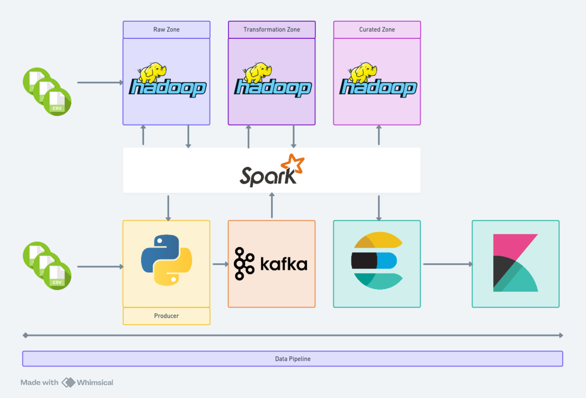

# Nikola Vukić E2 68/2023

Projekat iz Arhitekture sistema velikih skupova podataka.



## Opis sistema

Podaci su učitavani iz CSV formata u **raw zonu** na _HDFS_ pomoću _Pyspark_ alata.<br>
Potom, pomoću _Python_ skripte "transform_batch_data.py" su prebačeni u **transformation zonu** na _HDFS_.

### Batch obrada

Za potrebe batch obrade, odnosno upita podaci su povučeni u _Pyspark_ iz transformation zone te su rezultati upita čuvani u **curated zonu** na _HDFS_-u. Pored ovoga, rezultati svakog upita su sačuvani i na _Elasaticsearch_ da bi se, po potrebi, mogli vizualizovati na _Kibani_.


### Streaming obrada

Da bi se simulirao _streaming API_, podaci su iz CSV formata učitani u **Producer**-a, koji je napisan u _Python_-u. Potom, u _Pyspark_ su učitani **batch** podaci iz transformation zone, i spojeni na osnovu kolone "imdbId". Podaci koji su pronađeni u batch grupi podataka su poslani u _Kafka topic_. Takođe, svi streaming podaci se čuvaju u _Elasticsearch_-u kao **streaming sink**.

Za potrebe streaming upita, podaci su učitani u _Pyspark_ iz transformation zone. Takođe, _Pyspark_ klijent se pretplatio na Kafka topic, pa su po potrebi upita ova dva _Dataframe_-a spajana. Nakon izvršenja upita, podaci se čuvaju na _HDFS_-u u _paquet_ formatu, dok se takođe, čuvaju i na _Elasticsearch_-u, za potrebe vizuelizacije.

### Pokretanje

Kako je čitava aplikacija kontejnerizovana, neophodno se prvo repozicionirati u **docker** direktorijum. 
```sh
cd docker
```
Potom, neophodno je podići čitavu arhitekturu pomoću _Docker compose_ alata.
```sh
docker compose up
```
Kada **Producer** krene da šalje podatke u Kafku, sistem je spreman za rad. 

Pokretanje upita se vrši repozicioniranjem iz korijenskog direktorijuma u direktorijum u kome se nalaze skripta. 
```sh
cd docker/bash-scripts
```
Potom, potrebno je pokrenuti skripta za orkrestraciju upita. 
```
chmod +x orchestrate.sh && ./orchestrate.sh
```

**NAPOMENA:** Podaci se ne nalaze u _Github_ repozitorijumu jer zauzimaju previše memorije. 